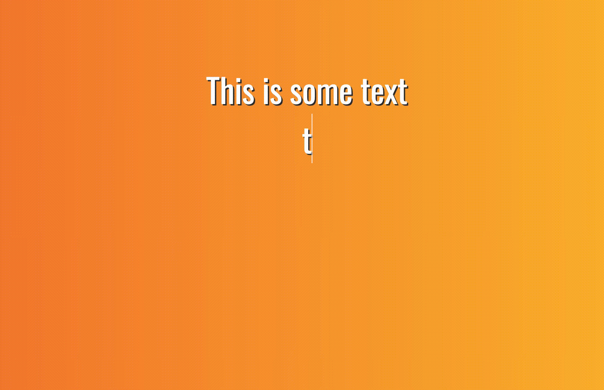

# text-prompt

Write text with a nice gradient background.

Run it here: [https://ddikman.github.io/text-prompt](https://ddikman.github.io/text-prompt)

The page is using only some css, a google font and the [contenteditable](https://developer.mozilla.org/en-US/docs/Web/HTML/Global_attributes/contenteditable) html attribute.

